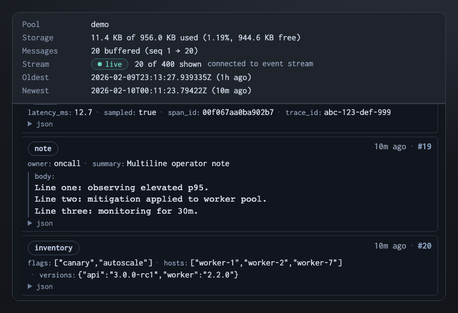

# Plasmite

[](https://github.com/sandover/plasmite/actions/workflows/ci.yml)
[](LICENSE)

**Easy interprocess communication.**

Interprocess communication should not be the hard part.

- Processes crash and restart — message channels should be resilient to that
- Messages should persist on disk so nothing ever gets lost
- For local IPC, you shouldn't need a server
- Messages should be human-inspectable at all times without ceremony
- Schemas are great but should be optional
- Disks should never fill up by surprise
- It should be fast, ideally with zero-copy reads

So, there's **Plasmite**.

<table width="100%">
<tr><th>Alice's terminal</th><th>Bob's terminal</th></tr>
<tr>
<td><pre lang="bash"># Alice creates a channel
pls pool create my-channel</pre></td>
<td></td>
</tr>
<tr>
<td></td>
<td><pre lang="bash"># Bob starts following
pls follow my-channel</pre></td>
</tr>
<tr>
<td><pre lang="bash"># Alice feeds the channel
pls feed my-channel \
  '{"from": "alice",
    "msg": "hello world"}'</pre></td>
<td></td>
</tr>
<tr>
<td></td>
<td><pre># Bob sees it arrive
{ "data": {"from": "alice", "msg": "hello world"}, ... }</pre></td>
</tr>
</table>

Plasmite is a CLI and library suite (Rust, Python, Go, Node, C) for sending and receiving JSON messages through persistent, disk-backed channels called "pools", which are ring buffers. There's no daemon, no broker, and no fancy config required, and it's quick (~600k msg/sec on a laptop).

For IPC across machines, `pls serve` exposes your local pools securely, and serves a minimal web UI too.

## Why not just...

| | Drawbacks | Plasmite |
|---|---|---|
| **Log files / `tail -f`** | Unstructured, grow forever, no sequence numbers, fragile parsing | Structured JSON with sequence numbers. Filter with tags or jq. Disk usage stays bounded. |
| **Temp files + locks** | No streaming, easy to corrupt, readers block writers | Writers append concurrently, readers stream in real time. No corruption, no contention. |
| **Redis / NATS** | Another server to run and monitor; overkill for single-host messaging | Just files on disk — no daemon, no ports, no config. If you only need local or host-adjacent messaging, don't introduce a broker. |
| **SQLite as a queue** | Polling-based, write contention, schema and vacuuming are on you | Built for message streams: follow/replay, concurrent writers, no schema, no cleanup, no polling. |
| **Named pipes** | One reader at a time, writers block, nothing persists | Readers and writers come and go freely. Messages survive restarts. |
| **Unix domain sockets** | Stream-oriented, no message framing, no persistence, one-to-one | Message boundaries and sequence numbers built in. Fan-out to any number of readers. |
| **Poll a directory** | Busy loops, no ordering, files accumulate forever | Messages stream in order. The ring buffer won't fill your disk. |
| **Shared memory** | No persistence, painful to coordinate, binary formats | Human-readable JSON on disk, zero-copy reads, no coordination pain. |
| **ZeroMQ** | No persistence, complex pattern zoo, binary protocol, library in every process | Durable and human-readable by default. One CLI command or library call to get started. |
| **Language-specific queue libs** | Tied to one runtime; no CLI, no cross-language story | Consistent CLI + multi-language bindings (Rust, Python, Go, Node, C) + versioned on-disk format. An ecosystem, not a single-language helper. |

## Real world use cases

### Build event bus

Your build script writes progress to a pool. In another terminal, you follow it in real time.

```bash
pls feed build --create '{"step": "compile", "status": "done"}'
pls feed build '{"step": "test", "status": "running"}'

# elsewhere:
pls follow build
```

### CI gate

Your deploy script waits for the test runner to say "green" — no polling loops, no lock files, no shared database.

```bash
# deploy.sh
pls follow ci --where '.data.status == "green"' --one > /dev/null && ./deploy.sh

# test-runner.sh
pls feed ci --create '{"status": "green", "commit": "abc123"}'
```

### System log intake

Pipe your system logs into a bounded pool. It won't fill your disk, and you can replay anything later.

```bash
journalctl -o json-seq -f | pls feed syslog --create       # Linux
pls follow syslog --since 30m --replay 1                       # replay last 30 min
```

### Tagged incident stream

Tag events when you write them, then filter and replay on the read side.

```bash
pls feed incidents --create --tag sev1 '{"msg": "payment gateway timeout"}'
pls follow incidents --tag sev1 --where '.data.msg | test("timeout")'
pls follow incidents --since 1h --replay 10
```

### Remote pools

Start a server and your pools are available over HTTP. Clients use the same CLI — just pass a URL.

```bash
pls serve                          # loopback-only by default
pls serve init                     # bootstrap TLS + token for LAN access

pls feed http://server:9700/events '{"sensor": "temp", "value": 23.5}'
pls follow http://server:9700/events --tail 20
```

A built-in web UI lives at `/ui`:



For CORS, auth, and deployment details, see [Serving & remote access](docs/record/serving.md) and the [remote protocol spec](spec/remote/v0/SPEC.md).

More examples — polyglot producer/consumer, multi-writer event bus, API stream ingest, CORS setup — in the **[Cookbook](docs/cookbook.md)**.

Plasmite is designed for single-host and host-adjacent messaging. If you need multi-host cluster replication, schema registries, or workflow orchestration, see [When Plasmite Isn't the Right Fit](docs/cookbook.md#when-plasmite-isnt-the-right-fit).

## Install

### macOS (recommended)

```bash
brew install sandover/tap/plasmite
```

Installs the CLI (`plasmite` + `pls`) and the full SDK (`libplasmite`, C header, pkg-config). Also required for Go bindings.

### Rust

```bash
cargo install plasmite     # CLI only (plasmite + pls)
cargo add plasmite         # use as a library in your Rust project
```

### Python

```bash
uv tool install plasmite   # standalone CLI + Python bindings
uv add plasmite            # add to an existing uv-managed project
```

Everything you need is included in the package — no separate compile step.

### Node

```bash
npm i -g plasmite
```

Everything you need is included in the package — no separate compile step.

### Go

```bash
go get github.com/sandover/plasmite/bindings/go/plasmite
```

Go bindings only (no CLI). Requires the system SDK — install via Homebrew first.

### Pre-built binaries

Download tarballs from [GitHub Releases](https://github.com/sandover/plasmite/releases). Each archive contains a full SDK layout: `bin/`, `lib/`, `include/`, and `lib/pkgconfig/`.

Windows builds (`x86_64-pc-windows-msvc`) are available as a best-effort preview. See the [distribution docs](docs/record/distribution.md) for details, troubleshooting, and registry setup.

## Commands

| Command | What it does |
|---|---|
| `feed POOL DATA` | Send a message (`--create` to auto-create the pool) |
| `follow POOL` | Follow messages (`--create` auto-creates missing local pools) |
| `fetch POOL SEQ` | Fetch one message by sequence number |
| `pool create NAME` | Create a pool (`--size 8M` for larger) |
| `pool list` | List pools |
| `pool info NAME` | Show pool metadata and metrics |
| `pool delete NAME...` | Delete one or more pools |
| `doctor POOL \| --all` | Validate pool integrity |
| `serve` | HTTP server (loopback default; non-loopback opt-in) |

`pls` and `plasmite` are the same binary. Shell completion: `plasmite completion bash|zsh|fish`.
Remote pools support read and write; `--create` is local-only.
For scripting, use `--json` with `pool create`, `pool list`, `pool delete`, `doctor`, and `serve check`.

## How it works

A pool is a single `.plasmite` file containing a persistent ring buffer:

- **Multiple writers** append concurrently (serialized via OS file locks)
- **Multiple readers** follow concurrently (lock-free, zero-copy)
- **Bounded retention** — old messages overwritten when full (default 1 MB, configurable)
- **Crash-safe** — processes crash and restart; torn writes never propagate

Every message carries a **seq** (monotonic), a **time** (nanosecond precision), optional **tags**, and your JSON **data**. Tags and `--where` (jq predicates) compose for filtering. See the [CLI spec § pattern matching](spec/v0/SPEC.md).

Default pool directory: `~/.plasmite/pools/`.

## Performance

| Metric | |
|---|---|
| Append throughput | ~600k msg/sec (single writer, M3 MacBook) |
| Read | Lock-free, zero-copy via mmap |
| On-disk format | [Lite3](https://github.com/fastserial/lite3) (zero-copy, JSON-compatible binary); field access without deserialization |
| Message overhead (framing) | 72-79 bytes per message (64B header + 8B commit marker + alignment) |
| Default pool size | 1 MB |

**How reads work**: The pool file is memory-mapped. Readers walk committed frames directly from the mapped region — no read syscalls, no buffer copies. Payloads are stored in [Lite3](https://github.com/fastserial/lite3), a zero-copy binary format that is byte-for-byte JSON-compatible — every valid JSON document has an equivalent Lite3 representation and vice versa. Lite3 supports field lookup by offset, so tag filtering and `--where` predicates run without deserializing the full message. JSON conversion happens only at the output boundary.

**How writes work**: Writers acquire an OS file lock, plan frame placement (including ring wrap), write the frame as `Writing`, then flip it to `Committed` and update the header. The lock is held only for the memcpy + header update — no allocation or encoding happens under the lock.

**How lookups work**: Each pool includes an inline index — a fixed-size hash table mapping sequence numbers to byte offsets. `fetch POOL 42` usually jumps directly to the right frame. If the slot is stale or collided, the reader scans forward from the tail. You can tune this with `--index-capacity` at pool creation time.

Algorithmic complexity below uses **N** = visible messages in the pool (depends on message sizes and pool capacity), **M** = index slot count.

| Operation | Complexity | Notes |
|---|---|---|
| Append | O(1) + O(payload bytes) | Writes one frame, updates one index slot, publishes the header. `durability=flush` adds OS flush cost. |
| Get by seq (`fetch POOL SEQ`) | Usually O(1); O(N) worst case | If the index slot matches, it's a direct jump. If the slot is overwritten/stale/invalid (or M=0), it scans forward from the tail until it finds (or passes) the target seq. |
| Tail / follow (`follow`, `export --tail`) | O(k) to emit k; then O(1)/message | Steady-state work is per message. Tag filters are cheap; `--where` runs a jq predicate per message. |
| Export range (`export --from/--to`) | O(R) | Linear in the number of exported messages. |
| Validate (`doctor`, `pool info` warnings) | O(N) | Full ring scan. Index checks are sampled/best-effort diagnostics. |

## Bindings

Native bindings:

```go
client, _ := plasmite.NewClient("./data")
pool, _ := client.CreatePool(plasmite.PoolRefName("events"), 1024*1024)
pool.Append(map[string]any{"sensor": "temp", "value": 23.5}, nil, plasmite.DurabilityFast)
```

```python
from plasmite import Client, Durability
client = Client("./data")
pool = client.create_pool("events", 1024*1024)
pool.append_json(b'{"sensor": "temp", "value": 23.5}', [], Durability.FAST)
```

```javascript
const { Client, Durability } = require("plasmite")
const client = new Client("./data")
const pool = client.createPool("events", 1024 * 1024)
pool.appendJson(Buffer.from('{"sensor": "temp", "value": 23.5}'), [], Durability.Fast)
```

See [Go bindings](bindings/go/README.md), [Python bindings](bindings/python/README.md), and [Node bindings](bindings/node/README.md).

## More

**Specs**: [CLI](spec/v0/SPEC.md) | [API](spec/api/v0/SPEC.md) | [Remote protocol](spec/remote/v0/SPEC.md)

**Guides**: [Serving & remote access](docs/record/serving.md) | [Distribution](docs/record/distribution.md)

**Contributing**: See `AGENTS.md` for CI hygiene; `docs/record/releasing.md` for release process


[Changelog](CHANGELOG.md) | Inspired by Oblong Industries' [Plasma](https://github.com/plasma-hamper/plasma).

## License

MIT. See [THIRD_PARTY_NOTICES.md](THIRD_PARTY_NOTICES.md) for vendored code.
