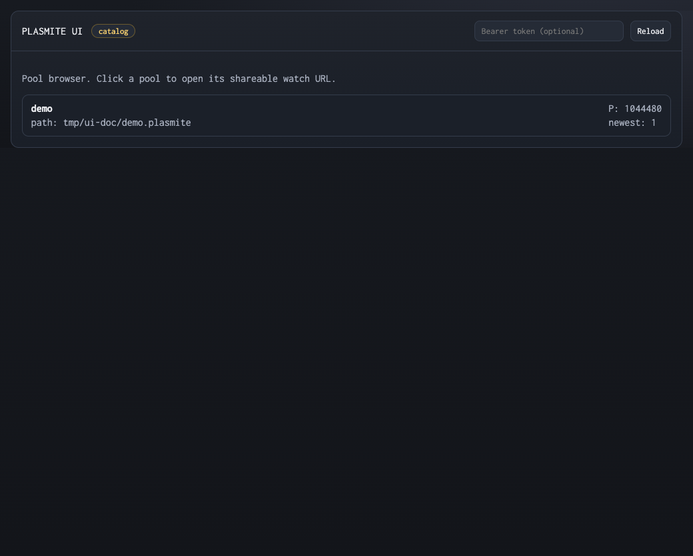
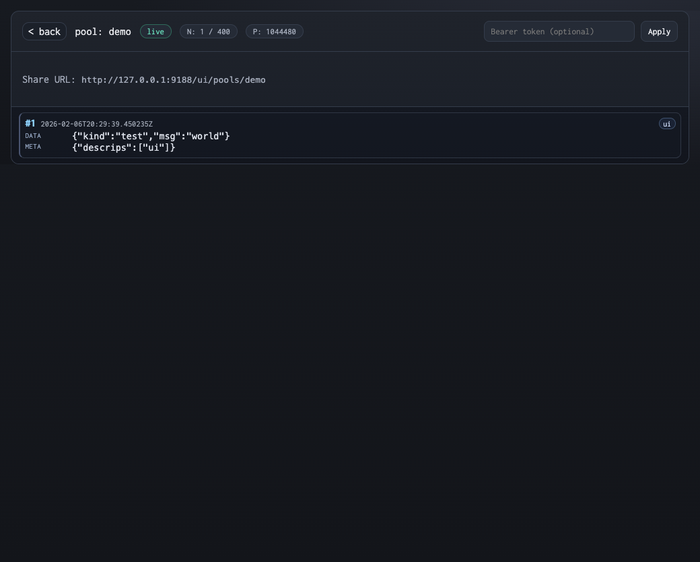

# Plasmite

[](https://github.com/sandover/plasmite/actions/workflows/ci.yml)
[](LICENSE)

Persistent JSON message queues backed by plain files, making interprocess communication easy and inspectable. Multiple processes can write and read concurrently. Message queues are ring buffers, so writes almost always succeed.
Plasmite also supports fast random access by sequence number (`plasmite get`) via an inline on-disk index.

Use Plasmite via the CLI, native bindings (Go, Python, Node), or the HTTP API.

```bash
# First, create a pool
pls pool create chat

# Bob's terminal - Bob starts watching (blocks, waiting for messages)
pls peek chat

# Alice's terminal - Alice sends messages
pls poke chat '{"from": "alice", "msg": "hello bob"}'
pls poke chat '{"from": "alice", "msg": "you there?"}'

# Bob's Terminal - Bob sees each message appear as Alice sends it:
#   {"seq":1,"time":"...","meta":{"tags":[]},"data":{"from":"alice","msg":"hello bob"}}
#   {"seq":2,"time":"...","meta":{"tags":[]},"data":{"from":"alice","msg":"you there?"}}
```

No daemon, no config. ~600k messages/sec on a laptop.

## Why Plasmite?

Common local IPC options have tradeoffs:
- Temp files need locking and don't support watching
- Named pipes block writers and allow only one reader
- Redis/RabbitMQ require running a daemon
- WebSockets require networking code

Plasmite pools are ring buffers that support multiple concurrent writers and readers. Messages are JSON, so you can filter with `jq`. Pools are regular files you can `ls` and `rm`. Writes are crash-safe.

| Alternative | Limitation | Plasmite |
|-------------|------------|----------|
| Temp files + locks | No watching, collision-prone | Multiple writers, real-time reads |
| Named pipes | Blocks writers, one reader | Non-blocking, multiple readers |
| Polling a directory | Busy loops, no ordering | Streaming with sequence numbers |
| Redis | Requires daemon | Just files |
| WebSockets | Requires server | No networking |

## Install

```bash
cargo install --path . --locked
```

This installs `plasmite` and the `pls` alias. Supported: **macOS** and **Linux**.

## Examples

### Watch a process from another terminal

**Terminal 1** - your build script:
```bash
pls poke build --create '{"step": "compile", "status": "running"}'
sleep 2  # ... compiling ...
pls poke build '{"step": "compile", "status": "done"}'
pls poke build '{"step": "test", "status": "running"}'
```

**Terminal 2** - you, watching:
```bash
pls peek build
```

### Coordinate two scripts

```bash
# Script A waits for a signal
echo "Waiting for go signal..."
pls peek signals --where '.data.go == true' --tail 1 --one > /dev/null
echo "Got it! Proceeding..."

# Script B sends the signal
pls poke signals --create '{"go": true}'
```

### Consume (or combine) streams from different sources

```bash
# Pipe JSON Lines from jq
jq -c '.items[]' data.json | pls poke foo --create

# Stream from curl (event streams auto-detected)
curl -N https://api.example.com/stream | pls poke events --create

# System logs (Linux)
journalctl -o json-seq -f | pls poke syslog --create

# System logs (macOS)
/usr/bin/log stream --style ndjson | pls poke syslog --create
```

### Replay with timing

```bash
# Replay last 100 messages at original speed
pls peek events --tail 100 --replay 1

# Replay at 2x speed
pls peek events --tail 50 --replay 2

# Replay at half speed (useful for analyzing fast streams)
pls peek sensor-data --since 5m --replay 0.5

# Replay without delays (bounded dump, exits when done)
pls peek events --tail 100 --replay 0
```

### Filter and transform

```bash
# Only errors
pls peek foo --where '.data.level == "error"'

# Only messages tagged "important" (exact tag match)
pls peek foo --tag important

# Tags compose with jq predicates via AND
pls peek foo --tag important --where '.data.level == "error"'

# Pipe to jq for transformation
pls peek foo --format jsonl | jq -r '.data.msg'

# Last 10 messages, then keep watching
pls peek foo --tail 10

# Messages from the last 5 minutes
pls peek foo --since 5m
```

### Use it from scripts

**Via CLI** (any language):
```bash
pls poke foo --create '{"from": "bash"}'
```

**Native bindings** (no subprocess overhead):

```go
// Go
client, _ := plasmite.NewClient("./data")
pool, _ := client.CreatePool(plasmite.PoolRefName("foo"), 1024*1024)
pool.Append(map[string]any{"from": "go"}, nil, plasmite.DurabilityFast)
```

```python
# Python
from plasmite import Client
client = Client("./data")
pool = client.create_pool("foo", 1024*1024)
pool.append_json(b'{"from": "python"}', [], "fast")
```

```javascript
// Node.js
const { Client } = require("plasmite-node")
const client = new Client("./data")
const pool = client.createPool("foo", 1024 * 1024)
pool.appendJson(Buffer.from('{"from": "node"}'), [], "fast")
```

**Replay from code** (all bindings support replay with speed control):

```go
// Go - replay at 2x speed
msgs, errs := pool.Replay(ctx, plasmite.ReplayOptions{Speed: 2.0})
for msg := range msgs {
    fmt.Println(string(msg))
}
```

```python
# Python - replay at original speed
for msg in pool.replay(speed=1.0):
    print(msg.decode())
```

```javascript
// Node.js - replay at 0.5x speed
const { replay } = require("plasmite-node")
for await (const msg of replay(pool, { speed: 0.5 })) {
  console.log(msg.toString())
}
```

See [Go quickstart](docs/go-quickstart.md), [bindings/python](bindings/python/README.md), and [bindings/node](bindings/node/README.md) for full documentation.

Binding validation from repo root:

```bash
just bindings-go-test
just bindings-python-test
just bindings-node-test
just bindings-test
```

## Commands

| Command | Description |
|---------|-------------|
| `poke POOL DATA` | Send a message (`--create` to auto-create pool) |
| `peek POOL` | Watch messages (streams until Ctrl-C; `--replay N` for timed playback) |
| `get POOL SEQ` | Fetch one message by seq number |
| `pool create NAME` | Create a pool (`--size 8M` for larger) |
| `pool list` | List pools |
| `pool info NAME [--json]` | Show pool metadata, bounds, and metrics |
| `pool delete NAME...` | Delete one or more pools |
| `doctor <POOL> \| --all` | Validate one pool or all pools |
| `serve` | Serve pools over HTTP (loopback default; non-loopback opt-in) |

Both `pls` and `plasmite` commands are supported.

## Shell Completion

Generate completion scripts from the CLI:

```bash
plasmite completion bash > /tmp/plasmite.bash
plasmite completion zsh > /tmp/_plasmite
plasmite completion fish > /tmp/plasmite.fish
```

Install by shell:

- `bash` (macOS/Linux): copy to `~/.local/share/bash-completion/completions/plasmite` (or `/etc/bash_completion.d/plasmite` system-wide), then `source ~/.bashrc`.
- `zsh` (macOS/Linux): copy to a directory in `$fpath` such as `~/.zfunc/_plasmite`, then run `autoload -U compinit && compinit` (or source from `~/.zshrc`).
- `fish`: copy to `~/.config/fish/completions/plasmite.fish`.

Verify:

```bash
plasmite <TAB>
```

## How It Works

### Pools

A pool is a **persistent ring buffer** - one `.plasmite` file:

- **Multiple writers** append concurrently (serialized via OS file locks)
- **Multiple readers** watch concurrently (lock-free, zero-copy)
- **Bounded retention** - old messages overwritten when full
- **Crash-safe** - torn writes never propagate

Default location: `~/.plasmite/pools/`. Create explicitly or use `--create` on first poke.

### Messages

```json
{
  "seq": 42,
  "time": "2026-02-03T12:00:00.123Z",
  "meta": { "tags": ["error", "db"] },
  "data": { "your": "payload" }
}
```

- **seq** - auto-incrementing ID (for ordering, deduplication, `plasmite get`)
- **time** - when it was written (RFC 3339, nanosecond precision)
- **meta.tags** - tags you add with `--tag` (for filtering with `--tag` and/or `--where`)
- **data** - your JSON payload

Tag messages when you poke them:
```bash
pls poke foo --tag error --tag db '{"msg": "connection lost"}'
```

Filter by tag when you peek:
```bash
pls peek foo --tag error
# exact match, repeat for AND semantics
pls peek foo --tag error --tag db
# combine with jq predicates
pls peek foo --tag error --where '.data.service == "billing"'
```

See [docs/design/pattern-matching-v0-iterative-spec.md](docs/design/pattern-matching-v0-iterative-spec.md) and [docs/pattern-matching.md](docs/pattern-matching.md) for a deeper guide.

### Scripting

Plasmite is built for scripts:
- **TTY**: Human-readable errors with hints
- **Pipes**: JSON errors on stderr, stable exit codes
- See [docs/exit-codes.md](docs/exit-codes.md) for the full list

Inspect pool diagnostics as JSON:

```bash
pls pool info foo | jq '.metrics'
```

Example metrics object:

```json
{
  "message_count": 42,
  "seq_span": 42,
  "utilization": {
    "used_bytes": 48128,
    "free_bytes": 996352,
    "used_percent": 4.61
  },
  "age": {
    "oldest_time": "2026-02-06T18:58:01Z",
    "newest_time": "2026-02-06T18:58:07Z",
    "oldest_age_ms": 93000,
    "newest_age_ms": 87000
  }
}
```

## Advanced

### Pool size

Default is 1MB. Old messages are overwritten when full:

```bash
pls pool create bigpool --size 64M    # More history
pls poke signals --create --create-size 64K '...'  # Tiny, ephemeral
```

### Durability

Default is fast (OS buffered). For critical data:

```bash
pls poke foo --durability flush '{"important": true}'
```

### Retries

Handle lock contention gracefully:

```bash
pls poke foo --retry 3 --retry-delay 100ms '{"data": 1}'
```

### Input modes

`poke` auto-detects JSONL, JSON-seq (0x1e), and event streams. Override with `--in`:

```bash
cat records.jsonl | pls poke foo --in jsonl
cat big.json | pls poke foo --in json
```

Skip bad records with `--errors skip` (exit 1 if any skipped).

## Remote Access

Serve pools over HTTP for access from other machines or containers.

### Starting the server

```bash
# Local-only (default, for dev)
pls serve

# Validate serve config and print effective endpoints without starting
pls serve check

# Secure non-loopback bootstrap (recommended)
pls serve init --output-dir ./.plasmite-serve
pls serve --bind 0.0.0.0:9700 --allow-non-loopback \
  --token-file ./.plasmite-serve/serve-token.txt \
  --tls-cert ./.plasmite-serve/serve-cert.pem \
  --tls-key ./.plasmite-serve/serve-key.pem

# Expose to LAN read-only (no auth required)
pls serve --bind 0.0.0.0:9700 --allow-non-loopback --access read-only

# Expose to LAN read-write (requires TLS + token)
pls serve --bind 0.0.0.0:9700 --allow-non-loopback \
  --token-file ~/.plasmite/token \
  --tls-cert /path/to/cert.pem --tls-key /path/to/key.pem
```

When `pls serve` runs in an interactive terminal, it prints a startup **next commands** block with:
- resolved base URL
- copy/paste append + tail examples
- auth and TLS notes for the active configuration

### Web UI (single-page, no build step)

When `pls serve` is running, a built-in web UI is always available:

```bash
# Pool browser
open http://127.0.0.1:9700/ui

# Shareable direct link to a specific pool
open http://127.0.0.1:9700/ui/pools/demo
```

The UI is a literal single HTML page (no React, no frontend build tooling) that uses server endpoints for pool list/info and live events.

- `N` shows how many messages are currently buffered in your browser tab.
- `P` shows the pool ring capacity from server metadata.
- If auth is enabled on `serve`, paste the bearer token in the UI token field to authorize requests.

Pool list view:



Pool watch view:



### From another machine

```bash
# Append from a remote host
pls poke http://server:9700/events '{"sensor": "temp", "value": 23.5}'

# Watch from a remote host (same shorthand POOLREF model)
pls peek http://server:9700/events --tail 20 --format jsonl
```

> **Note:** Remote `peek` supports shorthand refs (`http://host:port/<pool>`) with `--tail`, `--tag`, `--where`, `--one`, `--timeout`, `--data-only`, and `--format`. `--since` and `--replay` are local-only.

### From code

```javascript
// Node.js
const { RemoteClient } = require("plasmite-node")
const client = new RemoteClient("http://server:9700")
const pool = await client.openPool("events")
await pool.append({ sensor: "temp", value: 23.5 }, [])
```

> **Notes:** Remote `poke` and `peek` use shorthand URLs (`http://host:port/pool`). Pool creation is local-only. See [Remote protocol spec](spec/remote/v0/SPEC.md).

## Performance

Benchmarks on a laptop (M-series Mac, release build, 256-byte payloads):

- **Append**: 600k+ messages/sec (single writer, fast durability)
- **Follow latency**: sub-millisecond typical, ~3ms worst case
- **Concurrent writers**: scales to 8+ with graceful degradation

See [docs/perf.md](docs/perf.md) for the full benchmark suite.

### SIMD JSON Parsing

For higher throughput, build with the `simd` feature to enable [simd-json](https://github.com/simd-lite/simd-json) for JSON parsing:

```bash
cargo build --release --features simd
```

This can improve ingest performance by 2-4x on CPUs with AVX2/SSE4.2 support.

## Internals

Plasmite uses **[Lite³](https://github.com/fastserial/lite3)** (a zero-copy binary JSON format) for on-disk storage. The CLI is JSON-in/JSON-out - you never see Lite³ directly.

Inspired by Oblong Industries' [Plasma](https://github.com/plasma-hamper/plasma).

## More Info

**Specs** (normative contracts):
- [CLI spec](spec/v0/SPEC.md) - Stable contract for scripting
- [API spec](spec/api/v0/SPEC.md) - Public API for bindings
- [Remote spec](spec/remote/v0/SPEC.md) - HTTP/JSON remote protocol

**Guides**:
- [API quickstart](docs/api-quickstart.md) - Embedding in Rust
- [Go quickstart](docs/go-quickstart.md) - Using the Go bindings
- [libplasmite](docs/libplasmite.md) - Building the C ABI

**Reference**:
- [Architecture](docs/architecture.md) - How it's built
- [Exit codes](docs/exit-codes.md) - For robust error handling
- [Diagnostics](docs/doctor.md) - Pool validation
- [Changelog](CHANGELOG.md) - Version history

## License

MIT. See [THIRD_PARTY_NOTICES.md](THIRD_PARTY_NOTICES.md) for vendored code.
