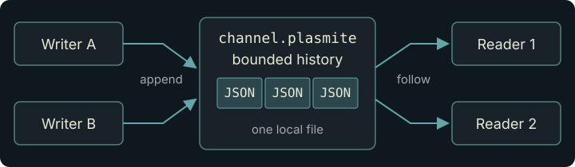
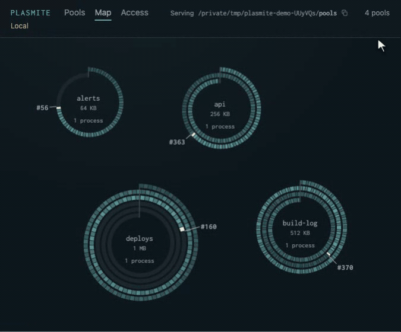

# Plasmite

[](https://github.com/sandover/plasmite/actions/workflows/ci.yml)
[](https://github.com/sandover/homebrew-tap)
[](https://crates.io/crates/plasmite)
[](https://pypi.org/project/plasmite/)
[](https://www.npmjs.com/package/plasmite)
[](https://pkg.go.dev/github.com/sandover/plasmite/bindings/go/local)
[](LICENSE)

**Easy interprocess communication.**

Plasmite is a CLI and library suite (Rust, Python, Go, Node, C) for sending and
receiving JSON messages through persistent, disk-backed channels called
**pools**. Each pool is one file that keeps a bounded history of messages,
overwriting the oldest when it fills. Local messaging needs no daemon or broker.



Local processes share the pool's file. Reading a message doesn't remove it;
each reader can start with recent history and keep following new messages.

## Install

Choose a CLI installation, then try the local example below. `pls` and
`plasmite` are the same binary.

| Channel | Install the CLI |
| --- | --- |
| Homebrew on macOS | `brew install sandover/tap/plasmite` |
| Cargo | `cargo install plasmite` |
| Python / uv | `uv tool install plasmite` |
| npm (Node.js 24+) | `npm i -g plasmite` |
| Linux and macOS SDK archives | [GitHub Releases](https://github.com/sandover/plasmite/releases) |

Python on Linux needs a separate system SDK. npm includes native bindings
for macOS, Linux x86_64, and Windows x86_64. See
[platforms and installation](#platforms-and-installation) for native libraries,
Windows packages, and Linux ARM previews.

## Local IPC

**Alice creates a channel (aka a pool)**

```bash
pls --dir ./pools pool create channel
```

**Alice sends a message**

```bash
echo '{"from":"A","msg":"hello world"}' | pls --dir ./pools feed channel
```

**Bob starts watching** — after Alice's sending process has exited:

```bash
pls --dir ./pools follow channel --tail 1 --json --data-only
```

**Bob sees it on stdout**

```json
{"from":"A","msg":"hello world"}
```

`--tail 1` reads the last retained message, then keeps watching. Alice and Bob
can start and stop independently. In another terminal, Alice can feed another
message into the same pool; Bob sees it without restarting. Press Ctrl+C to
stop following.


*[Still frame](docs/images/ipc/local-ipc.png) · [Recording and reproduction](docs/images/README.md)*

## Why Plasmite?

What would it take to make IPC pleasant and predictable?

- Reading and writing processes come and go... so **message channels should outlast them**
- Machines crash... so **channels should persist on disk**
- Disks are finite... so **channels should be bounded in size**
- Message brokers bring complexity and ceremony... so for local IPC, **don't require a broker**
- Observability matters... so **messages must be inspectable**
- Schemas are great... but **schemas should be optional**
- Latency matters... so **IPC should do only the work each operation needs**

So, there's **Plasmite**.

## Choosing a pool

A pool fits workflows where independent processes need a bounded, inspectable
history and can track their own progress. Local processes share its file;
HTTPS adds access from another machine without changing the message model.

Choose its capacity for the history you need. Writers do not wait for readers
to consume messages, and a slow reader can lose messages when the ring wraps. Plasmite provides no
consumer acknowledgments, work claiming, replication, or automatic retries.
Those guarantees belong in your application or a service designed to supply them.

**Use cases** — CI gates, live event streams, duplex chat, system log ring buffers, replay & debug: see the **[Cookbook](docs/cookbook.md)**.

Plasmite is for single-host and host-adjacent messaging. If you need multi-host cluster replication, schema registries, or workflow orchestration, see [When Plasmite Isn't the Right Fit](docs/cookbook.md#when-plasmite-isnt-the-right-fit).

## Libraries

The CLI and libraries use the same pools. Open the same directory from your
application to send and receive messages without starting a server.

| Language | Guide |
| --- | --- |
| Rust | [Library quickstart](README-crate.md#quick-start) |
| Python | [Python bindings](bindings/python/README.md#usage) |
| Go | [Go bindings](bindings/go/README.md#usage) |
| Node | [Node bindings](bindings/node/README.md#quick-start) |
| C | [C interface and ownership rules](include/plasmite.h) |

The bindings share message and retention semantics. Rust and the CLI provide
secure native connections; Node's HTTP client supports credential-free
loopback use but does not load saved access keys or verify their certificate
pins. Python, Go, C, and local Node bindings operate on local pools. See the
[binding guides](#more) for the methods each language exposes.

## Inspect and share pools

### Browse locally

Start the optional server against the same directory:

```bash
pls --dir ./pools serve --remote-bind 127.0.0.1:9743
```

Both listeners stay on this machine. Open `http://127.0.0.1:9700/ui/map`.

Watch messages arrive in the web UI. Click a pool to read its messages;
hover a message to find its place on the ring.

[](docs/record/serving.md#browse-pools)

*Sample events in four pools. The map shows their retained messages and live
traffic; hovering a message highlights its place on the ring.
[Still frame](docs/images/ui/pool-map.png).*

### Remote IPC

For IPC across machines, `pls serve` exposes local pools over HTTPS. Native
clients and browsers connect with an access key.
The access-key workflow is available in Plasmite 1.0. Follow
[Share your first pool](docs/record/serving.md#share-your-first-pool).

**Alice starts the server**

If the local browsing server is still running, stop it with Ctrl+C first.
Restart it with an address that Carol can reach:

Replace `alice.example.test` with that hostname in every command below.

```bash
pls --dir ./pools serve --shared-address https://alice.example.test:9743
```

In another terminal on the server:

```bash
pls --dir ./pools access invite --name Carol
```

Alice sends Carol the HTTPS address and access key privately. The key grants
full access to `./pools`, including creating and deleting pools.

**Carol connects and watches**

```bash
pls access connect https://alice.example.test:9743
pls follow https://alice.example.test:9743/channel --tail 1 --json --data-only
```

Carol enters the key at the hidden prompt. She can also open the HTTPS address
in a browser to sign in and browse the pools. See [browser access](docs/record/serving.md#open-pools-in-a-browser).

If Bob never quit his follow process, he's still watching the same pool.
If he stopped it, restart his local `follow` command before Alice sends.

**Alice sends**

```bash
echo '{"from":"A","msg":"hi all"}' | pls --dir ./pools feed channel
```

Both Bob and Carol see it:

```json
{"from":"A","msg":"hi all"}
```

### MCP clients

A local Model Context Protocol (MCP) process can work directly with local pools:

```bash
pls --dir ./pools mcp
```

A local MCP process can use a saved native connection; a remote MCP harness
can authorize in the browser. See [AI client setup](docs/record/serving.md#connect-an-ai-client)
for Claude Code and Codex CLI.

## How it works

A pool is a single `.plasmite` file containing a persistent ring buffer:

- **Multiple writers** append concurrently (serialized via OS file locks)
- **Multiple readers** follow concurrently; shared file locks protect each message snapshot
- **Bounded retention** — old messages overwritten when full (default 1 MB, configurable)
- **Committed frames** keep unfinished writes out of readers' results; choose flush durability when writes must reach disk before success

Every message carries a **seq** (monotonic), a **time** (nanosecond precision), optional **tags**, and your JSON **data**. Tags and `--where` (jq predicates) compose for filtering. See [Live Event Stream](docs/cookbook.md#live-event-stream).

Default pool directory: `~/.plasmite/pools/`. Plasmite does not acknowledge
consumption or keep messages until a reader handles them. Use sequence
checkpoints and [retention-gap detection](docs/cookbook.md#detect-retention-gaps)
when a consumer must notice lost history.

## Performance and storage

Payloads use [Lite3](https://github.com/fastserial/lite3), a binary JSON encoding.
Readers take owned message snapshots so a concurrent write cannot alter a message
while they inspect it.

The file is memory-mapped. Reads copy a validated message under a shared file
lock, then inspect the immutable snapshot after releasing the lock. Lite3
supports field lookup without decoding the full payload into JSON.

Writers encode before taking the exclusive file lock, then place the frame,
commit it, and publish the new bounds. An inline sequence index accelerates
`fetch`; a missing or stale slot falls back to scanning retained history.

Throughput depends on payload size, durability, readers, writers, and the host.
Run [`scripts/bench_runtime_lanes.sh`](scripts/bench_runtime_lanes.sh) for a
reproducible local measurement. The earlier lock-free read measurements do not
describe the 1.0 snapshot implementation.

See the [1.0 performance measurements](docs/performance/1.0-release.md) for
workloads, results, and their limits.

## Platforms and installation

### macOS

```bash
brew install sandover/tap/plasmite
```

Installs the CLI (`plasmite` + `pls`) and the full SDK (`libplasmite`, C header, pkg-config). Go bindings link against this SDK, so install Homebrew first if using Go.

### Linux ARM / Raspberry Pi (preview)

The published [1.0.0 release](https://github.com/sandover/plasmite/releases/tag/v1.0.0)
includes ARM archives with `plasmite`, `pls`, and the full SDK. You can run
local pools and the HTTPS server without installing Rust or a desktop.

| Linux userland | Archive suffix | Minimum |
| --- | --- | --- |
| ARM64 (64-bit) | `linux_arm64` | ARMv8-A, glibc 2.35 |
| ARMv7 (32-bit hard-float) | `linux_armv7` | Armv7-A with VFPv3-D16 and Thumb-2, glibc 2.35 |

A Raspberry Pi 2 running Raspberry Pi OS Lite (32-bit) uses `linux_armv7`.
Choose the archive for the installed userland; a 64-bit kernel can run a
32-bit userland.

Both targets passed [earlier hosted CI](https://github.com/sandover/plasmite/actions/runs/36803923793),
including extracted CLI/library checks and HTTPS recovery. ARMv7 uses QEMU
emulation. Physical Pi installation and reboot checks remain pending.

See the [ARM installation guide](docs/record/distribution.md#linux-arm-sdk-preview-install)
for published downloads, checksums, and setup. ARMv7 pools can be at most
2,147,483,647 bytes (2 GiB minus one byte). ARMv6 is unsupported.

### Rust

```bash
cargo install plasmite     # CLI only
cargo add plasmite         # use as a library in Rust projects
```

### Python

```bash
uv tool install plasmite   # standalone CLI + Python bindings
uv add plasmite            # add to a uv-managed project
```

PyPI ships pre-built native bindings on macOS and Windows x86_64. Linux
x86_64 users can install the system SDK through Homebrew or a GitHub release
tarball. Linux ARM users can use the preview SDK archives. See the
[distribution guide](docs/record/distribution.md#install-matrix) for the current matrix.

### Node

Requires **Node.js 24 or newer**, including for the npm CLI.

```bash
npm i -g plasmite
```

The package includes pre-built native bindings for macOS, Linux x86_64, and
Windows x86_64. Linux ARM has no published npm native addon or CLI; use the
SDK preview archives for its native CLI/server. Installing that SDK does not
add a Node addon.

### Go

```bash
go get github.com/sandover/plasmite/bindings/go/local
```

Bindings only (no CLI). Links against `libplasmite` via cgo, so first get the SDK via Homebrew on macOS, or from a [GitHub Releases](https://github.com/sandover/plasmite/releases) tarball on Linux.

### Pre-built binaries

Tarballs for Linux and macOS are on [GitHub Releases](https://github.com/sandover/plasmite/releases). Each archive contains `bin/`, `lib/`, `include/`, and `lib/pkgconfig/`.

Windows builds (`x86_64-pc-windows-msvc`) are available via npm and PyPI. See the [distribution docs](docs/record/distribution.md) for the full install matrix.

Updating an earlier installation? Read the [1.0 upgrade guide](docs/record/upgrading-1.0.md)
for output flags, history rules, and secure-sharing migration.

## Command Overview

**Messaging**

| | |
|---|---|
| `feed` *pool* *data* | Send a message |
| `follow` *pool* | Follow messages |
| `fetch` *pool* *seq* | Fetch one message by sequence number |
| `duplex` *pool* | 2-way session with a pool |
| `tap` *pool* `--` *command…* | Capture a process's output |

**Pool management**

| | |
|---|---|
| `pool create` *name* | Create a pool |
| `pool list` [*server*] | List local pools or a remote server's pools |
| `pool info` *pool* | Show local or remote pool metadata and metrics |
| `pool delete` *name…* | Delete one or more pools |
| `doctor` *pool* ǀ `--all` | Validate pool integrity |

**Server**

| | |
|---|---|
| `serve` [*server*] | Serve local pools over loopback HTTP and remote HTTPS |
| `serve install` [*server*] | Start the server and arrange boot startup on Linux or macOS |
| `serve start/stop/restart/uninstall` | Control the installed server for `--dir` |
| `serve logs` | Read the installed server log |
| `serve status` [`--all`] | List live servers, or include installed stopped setups |
| `access invite` *name* | Create an access key for another client |
| `access connect` | Verify a server and save its access key |
| `access list` | List saved server destinations |
| `access status` | Check a saved server connection |
| `access disconnect` | Forget a saved connection locally |
| `access revoke` | Withdraw a server key's access |

**Agent and CLI support**

| | |
|---|---|
| `mcp` [*server*] | Run local or saved remote Model Context Protocol over stdin/stdout |
| `version` | Print version information |
| `completion` *shell* | Generate shell completion |

`pls` and `plasmite` are the same binary. See the [CLI guide](docs/cli.md) for pool references, input and output modes, and exit behavior.

## More

**Specs**: [CLI](spec/v0/SPEC.md) | [API](spec/api/v0/SPEC.md) | [Remote protocol](spec/remote/v0/SPEC.md) | [MCP](spec/mcp/2025-11-25/SPEC.md)

**Bindings**: [Rust](README-crate.md) | [C](include/plasmite.h) | [Go](bindings/go/README.md) | [Python](bindings/python/README.md) | [Node](bindings/node/README.md)

**Guides**: [CLI](docs/cli.md) | [Serving & remote access](docs/record/serving.md) | [Distribution](docs/record/distribution.md)

**Contributing**: See `AGENTS.md` for CI hygiene; `docs/record/releasing.md` for release process


[Changelog](CHANGELOG.md) | Inspired by Oblong Industries' [Plasma](https://github.com/plasma-hamper/plasma).

## License

MIT. See [THIRD_PARTY_NOTICES.md](THIRD_PARTY_NOTICES.md) for vendored code.
