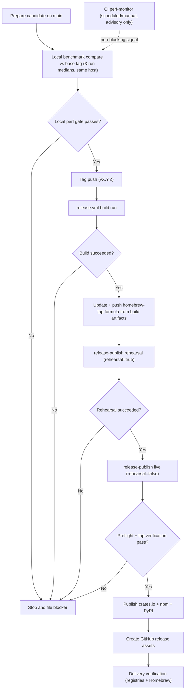

# Releasing Plasmite

This document is the human-facing policy for releases.  
The canonical procedural runbook lives in the release skill so we do not maintain two independent checklists.

## Canonical Source of Truth

Use the release skill for all release execution details:

- `skills/plasmite-release-manager/SKILL.md`
- `skills/plasmite-release-manager/references/qa-gates.md`
- `skills/plasmite-release-manager/references/release-hygiene.md`
- `skills/plasmite-release-manager/references/delivery-verification.md`

If this file and the skill ever disagree, follow the skill and then update this file or the skill to re-align.

## Release Policy

- Releases are fail-closed: any failed or incomplete gate blocks release.
- Every blocker is filed in `ergo` under one epic: `Release blockers: <release_target>`.
- Do not tag or publish while blocker tasks remain open.
- Do not release from a branch with unpushed commits (`git status --short --branch` must not show `ahead`).
- Use a runtime that can reach GitHub and registries and can use maintainer `gh` auth.
- Release automation is split: `release.yml` builds artifacts, `release-publish.yml` performs preflight + registry publish + GitHub release.
- Homebrew parity is mandatory: `release-publish.yml` must block registry publish until Homebrew formula version/URLs/checksums are aligned.
- Publish-only retry after credential fixes must re-use a successful build run ID (no matrix rebuild required).

## Workflow Diagram

## Human Decisions to Make Per Release

The skill handles mechanics, but maintainers still decide:

- release target and timing
- whether any compatibility risk is acceptable
- whether registry/tap propagation delays are acceptable
- whether any exception is explicitly approved and documented

## Minimal Maintainer Checklist

1. Choose version and update release notes/changelog.
2. Ask Codex to run the `plasmite-release-manager` skill in `dry-run`.
3. Resolve all blocker tasks created by the dry-run.
4. Push all local commits you intend to ship, then confirm release source SHA is fully on origin.
5. Run local benchmark comparison against the prior tag:
   - `bash skills/plasmite-release-manager/scripts/compare_local_benchmarks.sh --base-tag <base_tag> --runs 3`
6. Ask Codex to run the skill in `live` mode.
7. Update and push `../homebrew-tap` formula for this target using build artifacts.
8. Confirm post-release delivery verification is complete on all channels.
9. If publish fails due to credentials/policy, run publish-only rerun with the successful build run ID:
   - `gh workflow run release-publish.yml -f build_run_id=<build-run-id> -f rehearsal=false -f allow_partial_release=false`

## Versioning Notes

- Tags use `vX.Y.Z` format.
- CLI and official bindings ship in lock-step versioning.
- See `docs/record/versioning.md` for versioning invariants.
