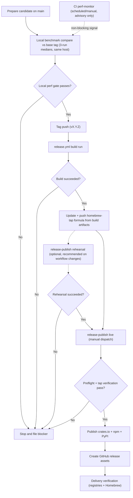

# Releasing Plasmite

This document is the human-facing policy for releases, plus a plain-English explanation of what the build + release pipeline *does*.

The canonical procedural runbook (commands, exact sequencing, edge cases) lives in the release skill so we do not maintain two independent checklists.

## Canonical Source of Truth

Use the release skill for all release execution details:

- `skills/plasmite-release-manager/SKILL.md`

If this file and the skill ever disagree, follow the skill and then update this file or the skill to re-align.

## Build + Release, in Plain English

Think of a Plasmite release as answering two questions:

1. **What exact code are we shipping?** (a specific git commit, pinned by a version tag like `v0.2.3`)
2. **Can users install that exact build reliably from every channel we support?** (GitHub tarballs, Homebrew, crates.io, npm, PyPI)

We split the work into two big stages so that “building” and “publishing” are decoupled:

- **Build stage (GitHub)**: compile + package everything, and upload the results as artifacts.
- **Publish stage (GitHub)**: manually dispatch `release-publish.yml` with a successful build run ID, verify provenance and Homebrew alignment, then publish to registries and create the GitHub Release. There is no automatic trigger from the build workflow.

This split is intentional: if a registry token is expired (or a policy check fails), we can re-run the publish stage without rebuilding the entire multi-platform build.

### Where the work happens

- **On a maintainer machine**
  - Pick the release version and prepare the release notes / changelog.
  - Run a *local* performance comparison against the prior tag (release-blocking).
  - Push a version tag (which is the “official pointer” to the commit being released).
  - Update the Homebrew tap formula repo to point at the release tarballs and checksums.
- **On GitHub Actions**
  - Build and package release artifacts for supported platforms.
  - Re-download those artifacts by build run ID, verify they match the tag/version, and then publish to registries + GitHub Releases.

### Stages and gates (what they’re for, and what they cost)

Costs below are intentionally qualitative; exact runtimes vary by machine and GitHub runner load.

1. **Prepare a candidate (local)**
   - Purpose: ensure you’re not shipping something you haven’t reviewed/tested.
   - Gate: “Everything you intend to ship is pushed to origin; no local-only commits.”
   - Cost: cheap to moderate (mostly waiting on tests).

2. **Performance gate (local, release-blocking)**
   - Purpose: catch “it got 2× slower” regressions *before* any tags or publishes.
   - Gate: compare candidate vs a baseline tag on the **same host** (reduces noise).
   - Cost: moderate (benchmarks take minutes, but don’t require GitHub).

3. **Build artifacts (GitHub, `release.yml`)**
   - Purpose: produce installable artifacts for each supported platform and binding ecosystem.
   - Gate: every build + packaging + smoke test job must succeed for the matrix targets.
   - Cost: expensive (multi-platform compilation + packaging; typically the longest stage).
   - Output (high-level):
     - “SDK tarballs” for macOS (Intel + Apple Silicon) and Linux (x86_64)
     - Python distributions (sdist + wheels for supported platforms)
     - Node publish artifact (an npm tarball)

4. **Homebrew parity (maintainer + GitHub, release-blocking)**
   - Purpose: prevent a release where Homebrew points at stale or mismatched tarballs.
   - Gate (GitHub, `release-publish.yml`): formula version/URLs/checksums must match the build artifacts exactly.
   - Cost: cheap (verification is fast; the human part is updating the tap repo).

5. **Publish to registries (GitHub, `release-publish.yml`)**
   - Purpose: make the same version available via crates.io, npm, and PyPI.
   - Gates:
     - token “can we log in?” checks (fail fast if CI can’t authenticate)
     - “publish what we built” checks (publish is only allowed from a successful build run that matches the tag/version)
     - Homebrew parity check (above) must pass *before* any registry publishes
   - Cost: moderate (mostly network + registry processing).

6. **Create/update the GitHub Release (GitHub, `release-publish.yml`)**
   - Purpose: attach the platform tarballs (SDK layout) and checksums to the tag so users can download from GitHub directly.
   - Gate: only runs after all enabled publish channels succeed (or an explicit, documented bypass).
   - Cost: cheap.

7. **Delivery verification (human/automation, post-release)**
   - Purpose: confirm the “happy path” works for real users (install + run) across channels.
   - Gate: not a publish gate (publishing already happened), but it’s a release-quality requirement.
   - Cost: moderate (some waiting for registry propagation).

### Why the performance gate is local (and CI perf is advisory)

GitHub runners are shared machines, so benchmark numbers can swing due to factors unrelated to our code. For release decisions we prefer “same host, same conditions” comparisons on a maintainer machine.

CI still runs a scheduled benchmark (`perf-monitor.yml`) to catch trend regressions and provide a paper trail, but it is intentionally non-blocking.

### “Rehearsal” mode (publish without publishing)

`release-publish.yml` supports a rehearsal mode that runs the same preflight/provenance/tap checks, but skips actually publishing to registries or GitHub Releases. Use it when you change release automation or when you want a safe “end-to-end confidence check” before going live.

## Release Policy

- Releases are fail-closed: any failed or incomplete gate blocks release.
- Every blocker is filed in `ergo` under one epic: `Release blockers: <release_target>`.
- Do not tag or publish while blocker tasks remain open.
- Do not release from a branch with unpushed commits (`git status --short --branch` must not show `ahead`).
- Use a runtime that can reach GitHub and registries and can use maintainer `gh` auth.
- Release automation is split: `release.yml` builds artifacts, `release-publish.yml` performs preflight + registry publish + GitHub release.
- Homebrew parity is mandatory: `release-publish.yml` must block registry publish until Homebrew formula version/URLs/checksums are aligned.
- Publish-only retry after credential fixes must re-use a successful build run ID (no matrix rebuild required).

## Workflow Diagram

## Human Decisions to Make Per Release

The skill handles mechanics, but maintainers still decide:

- release target and timing
- whether any compatibility risk is acceptable
- whether registry/tap propagation delays are acceptable
- whether any exception is explicitly approved and documented

## Minimal Maintainer Checklist

1. Choose version and update release notes/changelog.
2. Ask Codex to run the `plasmite-release-manager` skill in `dry-run`.
3. Resolve all blocker tasks created by the dry-run.
4. Push all local commits you intend to ship, then confirm release source SHA is fully on origin.
5. Run local benchmark comparison against the prior tag:
   - `bash skills/plasmite-release-manager/scripts/compare_local_benchmarks.sh --base-tag <base_tag> --runs 3`
6. Ask Codex to run the skill in `live` mode.
7. Update and push `../homebrew-tap` formula for this target using build artifacts.
8. Confirm post-release delivery verification is complete on all channels.
9. If publish fails due to credentials/policy, run publish-only rerun with the successful build run ID:
   - `gh workflow run release-publish.yml -f build_run_id=<build-run-id> -f rehearsal=false`

## Versioning Notes

- Tags use `vX.Y.Z` format.
- CLI and official bindings ship in lock-step versioning.
- See `docs/record/versioning.md` for versioning invariants.
